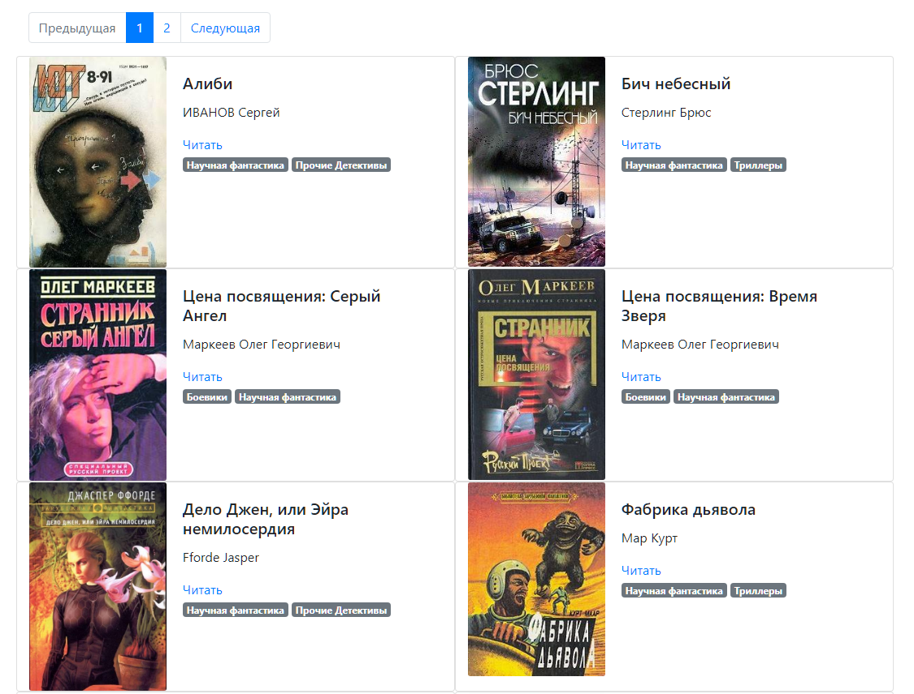
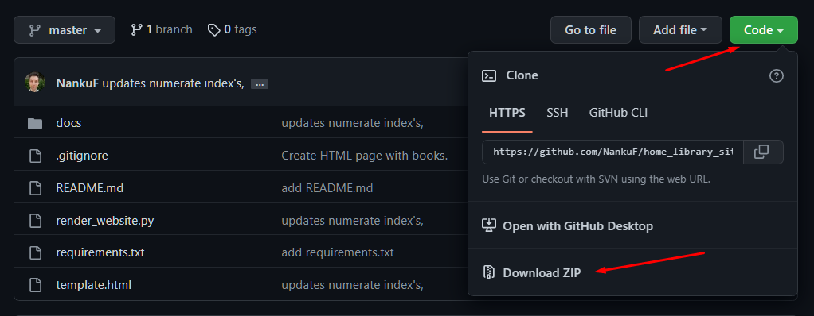
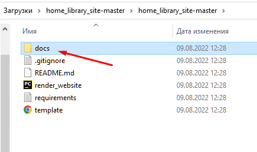
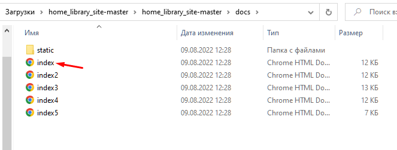

# Домашняя библиотека

Библиотека доступна по [ссылке.](https://nankuf.github.io/home_library_site/static/pages/index.html)<br>



Данные взяты с сайта [tululu.org](https://tululu.org/)

### Как развернуть библиотеку на своем компьютере:
1. Скачайте репозиторий:
<br>
2. Разархивируйте архив.
3. Перейдите в папку `docs`:<br>

4. Кликните дважды на `index.html`

5. Готово! Вы можете пользоваться библиотекой на своем компьютере.

### Инструкция для разработчиков
1. Скачайте проект:<br>

```commandline
git clone https://github.com/NankuF/home_library_site.git
```

2. Перейдите в директорию:

```commandline
cd home_library_site
```
3. Создайте виртуальное окружение:<br>

```commandline
python -m venv venv
```

4. Активируйте виртуальное окружение:<br>
Unix
```commandline
. ./venv/bin/activate
```
Windows
```commandline
. .\venv\Scripts\activate
```
5. Установите зависимости:<br>

```commandline
pip install -r requirements.txt
```
6. Результаты парсинга (книги, изображения, json) хранятся в директории `parse_result`.<br>
Название файла json хранится в константе `JSON_FILENAME` в `render_website.py`.<br>
Для наполнения библиотеки вам необходимо написать парсер, который будет скачивать:<br>
Книги в `parse_result/books`,<br>
Изображения в `parse_result/images`,<br>
json в `parse_result`.

    Структура json должна соответствовать json из библиотеки.
7. Запустите скрипт для генерации страниц библиотеки:<br>
```commandline
python render_website.py
```
8. Библиотека `livereload` ломает кодировку. Поэтому после генерации страниц библиотеку следует открывать из `static/pages/`.


*Это учебный проект курса "Вёрстка для питониста" с сайта [devman.](https://dvmn.org/modules/website-layout-for-pydev/)*